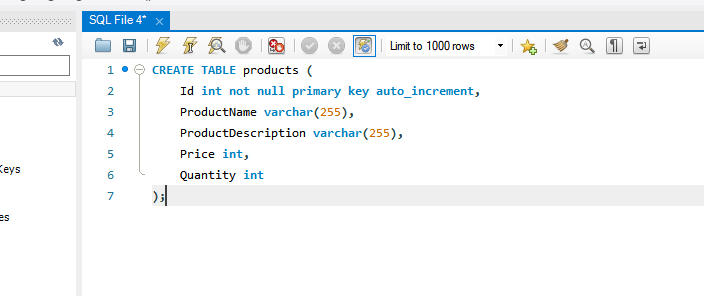
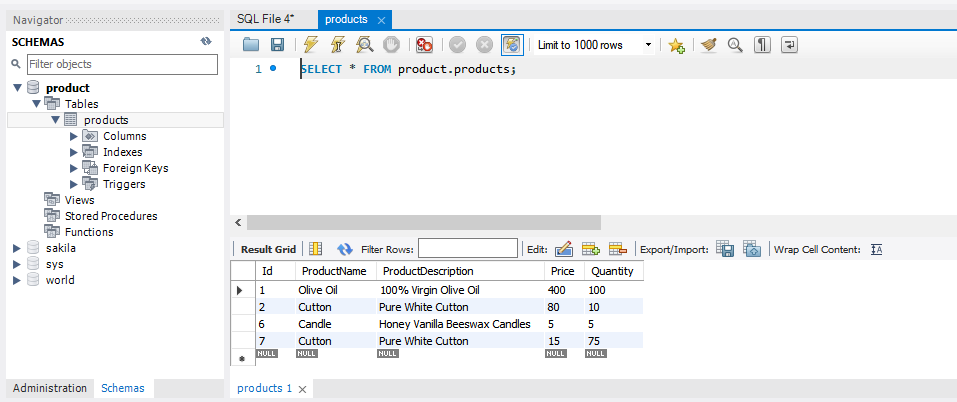
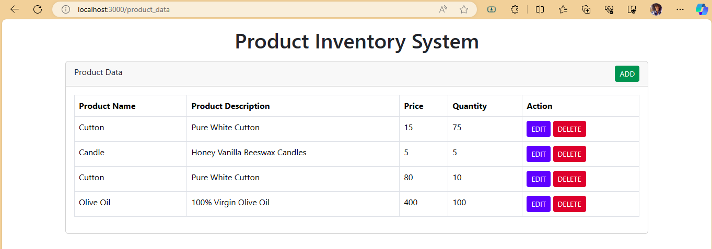
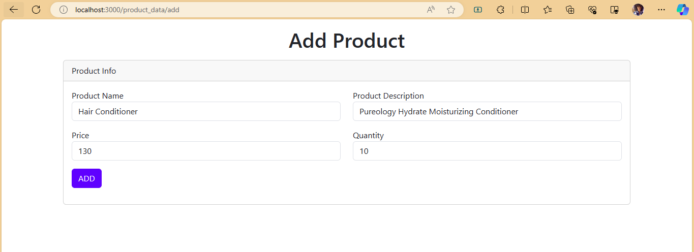
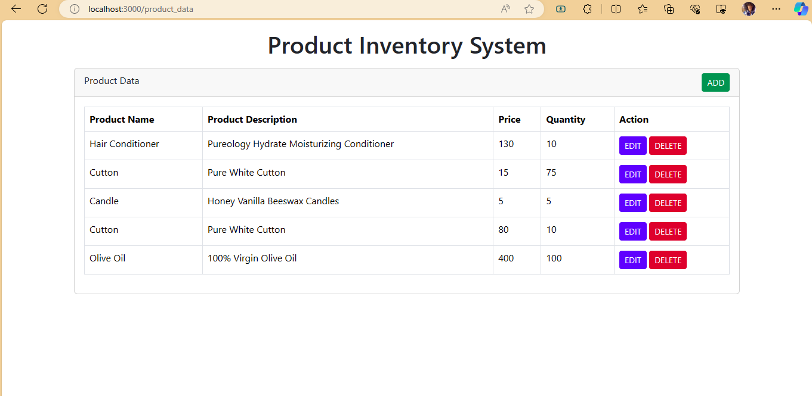
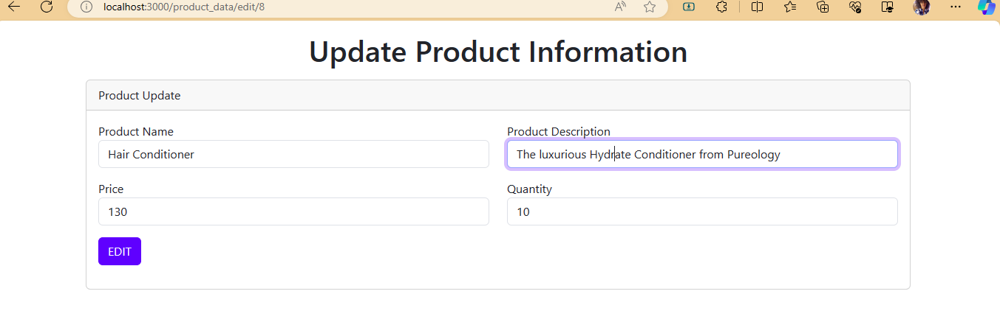
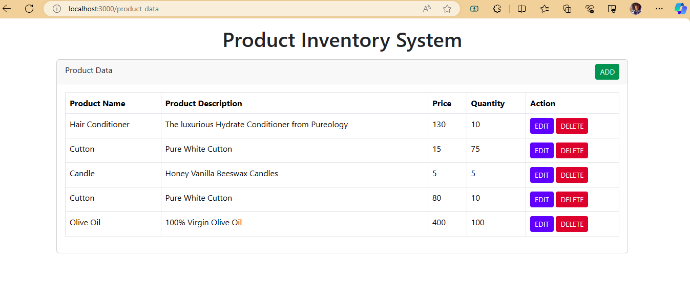
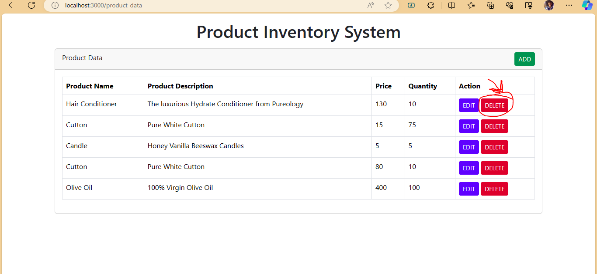
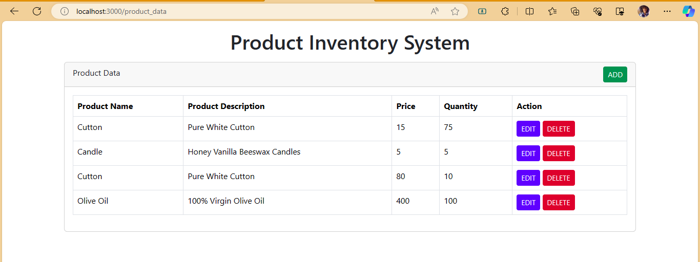

# Product Inventory System- Product Inventory System with CRUD Operation

## Table of contents

- [Overview](#overview)
  - [The challenge](#the-challenge)
  - [Screenshot/how to use](#screenshot)
  - [Links](#links)
- [My process](#my-process)
  - [Built with](#built-with)
  - [Continued development](#continued-development)
- [Author](#author)

## Overview

### The challenge

Users should be able to:

- enter product details
- retrieve the product inventory
- mark products as available or out of stock
- edit product details
- remove products from the product inventory

The system should be able to:

- save the new product in database
- display the newly added product in the user's product list
- display product details
- update the product's information in database when changes are made
- remove products from database
- update the product list display to remove the deleted product

The system may be able to:

- implement filters to allow users to display only available or out-of-stock products

### Screenshot/how to use

How to use this system locally: [install modules if only they don't exist in the node modules folder or you want an update]
- install nodejs and npm from nodejs official website
- install nodejs express module in your project with this command: npm install express --save
- install mysql server in your computer
- install nodejs driver for mysql in your project with this command: npm install mysql --save
- have a database with name "product" in mysql
- make sure you use the root user in mysql for your project or make the user have all the privilages to perform the crud operations
- under product make a table with name "products" and with columns "ProductName", "ProductDescription", "Price", "Quantity", and an "Id" primary key that auto increments by one.
the following 2 screenshots are the "query" to make the table and the actual table in mysql:

- install express generator in your project with this command: npm install -g express-generator
- install javascript template engine in your project with this command: npx express --view=ejs
- install dependencies with: npm install --save
- type in terminal this command to run project: npm start
- type in search bar this path: localhost/3000/product_data

Folowing are screenshots that show what each page look like:

### Links

- Solution URL: [Add solution URL here](https://your-solution-url.com)
- Live Site URL: [Add live site URL here](https://your-live-site-url.com)

## My process

### Built with

- ejs
- bootstrap css framework
- nodejs
- express
- MySQL
- VSCode editor

### Continued development

this system lacks the optional requirement which is to add filter to display in or out of stock products, to add in future developments.
and the user interface should be extremely beautiful by adding product images and styling each html elements.

## Author

- Betelhem Yemane - betelhemyemanezoom@gmail.com
